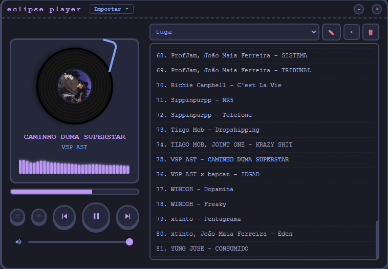

# Eclipse Player

A minimalist and elegant local music player built with Electron. Features a side-by-side design, dark/neon theme, metadata reading with a dynamic vinyl record, and advanced playlist management.

## Features

* Side-by-Side Interface: Responsive and resizable layout for maximum visibility of tracks and controls.
* Metadata Reading (ID3): Automatic extraction of track name, artist, and album cover directly from audio files.
* Dynamic Vinyl: The album cover is displayed in the center of a vinyl record that spins during playback.
* Playlist Management:
  * Create multiple custom playlists.
  * Rename and delete lists.
  * Data persistence: playlists and tracks are saved locally and loaded when the app starts.
* Mass Import: Load individual audio files or entire directories with a single click.
* Advanced Audio Engine: Support for local streaming via a custom protocol (local-media://), allowing seamless seeking through the track timeline.
* Shuffle Mode: Smart track mixing that ensures the previous track is not repeated.
* Custom Window: Native frameless design without standard operating system borders.

## Technologies Used

* [Electron](https://www.electronjs.org/)
* [Vite](https://vitejs.dev/)
* [TypeScript](https://www.typescriptlang.org/)
* [jsmediatags](https://github.com/aadsm/jsmediatags)
* Pure HTML5 & CSS3

## How to Run the Project

git clone https://github.com/bernam07/eclipse-player.git
cd eclipse-player

npm install

npm run watch:main

npm run vite:dev

npm run start

## How to Build

npm run build

## License

This project is open-source and available under the [MIT](LICENSE) license.